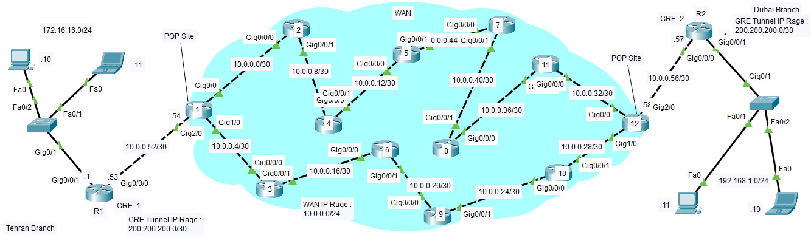

# Cisco
Cisco projects and scenarios with explanations and documentation

## Architectural Network Scenarios: From Concept to Configuration

- STP
- OSPF
- VLAN
- HSRP
- SVI
- ROAS
- ACL
- Redundancy
- ...

## Picture
There are some pictures of scenarios here

## Feedback

If you have any feedback, please reach out to us at 
https://rezaferdosara.ir/

